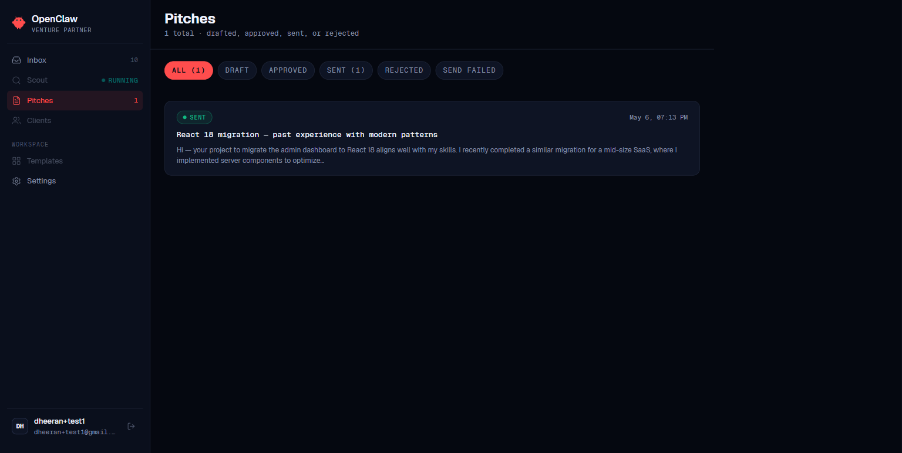
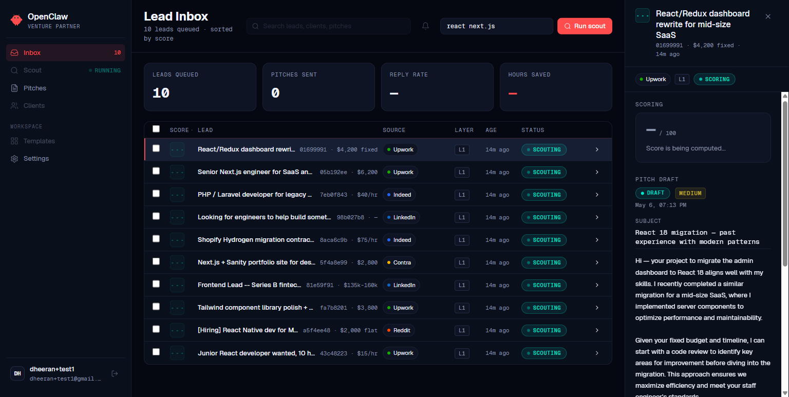
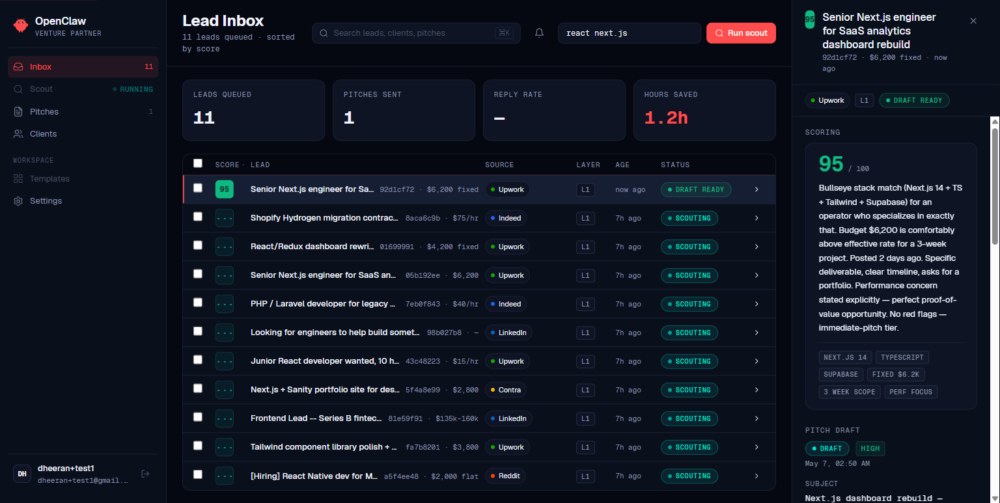

# OpenClaw Venture Partner

> Autonomous AI deal-flow agent for freelancers and small agencies. Drafts every outbound email, never sends without explicit human approval.

Live demo: **[openclaw-venture-partner-web.vercel.app](https://openclaw-venture-partner-web.vercel.app/)**

Built by **ClawGrowth** at RV College of Engineering on top of [OpenClaw](https://github.com/openclaw/openclaw), the open-source personal-AI-assistant platform.

---

## Submission materials

All hackathon submission artefacts live under [`submission/`](./submission):

| File | Purpose |
|---|---|
| [`submission/demo-video.mp4`](./submission/demo-video.mp4) | 90-second product walkthrough — Scout → Architect → Negotiator with human approval on Telegram |
| [`submission/theme-genai-pitch.pdf`](./submission/theme-genai-pitch.pdf) | Theme write-up: "Productivity — freelancing is repetitive scaffolding work; LLMs were built to absorb exactly this layer, but every shipped tool fully automates and breaks the trust loop" |
| [`submission/OpenClaw_AI_Disclosure.docx`](./submission/OpenClaw_AI_Disclosure.docx) | AI tool usage disclosure |

Screenshots under [`docs/screenshots/`](./docs/screenshots).

---

## What it does

OpenClaw VP runs the full deal flow for solo freelancers and 2–5 person agencies. Three layers, all gated by human approval:

| Layer | Action | Approve from |
|---|---|---|
| **Scout** | Scrapes Upwork / LinkedIn / Indeed / Reddit / Contra / Freelancer, dedups, scores each lead 0–100 against the operator's profile | – |
| **Architect** | Drafts personalized outreach with a Lighthouse audit attached as proof-of-value | Telegram, Discord, or Web |
| **Negotiator** | Classifies inbound replies, drafts 3 reply options, maintains diff-based client memory, flags upsell candidates | Telegram, Discord, or Web |

The brand promise: **draft-only, never sends without explicit approval.** Every approval is cryptographically verified — a `payload_hash` of the pitch content is computed at draft time and recomputed at approve time; mismatch returns a `409 stale_draft` and refuses to send.

---

## The 90-second demo

1. **Scout & score (0:00–0:30)** — operator types `senior next.js engineer for SaaS dashboards`, scout pipeline runs in real time, leads stream into the inbox with scores and reasoning. Top lead is a $6,200 Next.js dashboard rebuild — score 95.
2. **Draft & notify (0:30–1:00)** — operator clicks **Draft pitch**. Pitch body streams in. The same pitch arrives on the operator's phone in Telegram with **Approve / Reject** buttons.
3. **Approve & send (1:00–1:30)** — operator taps **Approve** in Telegram. Webhook verifies the `payload_hash`, fires `pitch/approved`, the worker sends via Resend. The dashboard flips to **Sent** in real time. Audit log records `actor_platform: 'telegram'`.

Everything above is real: real Supabase database, real LLM calls through a 3-provider chain, real Telegram bot, real email sent via Resend, real OpenClaw Gateway running on Oracle Cloud Always Free.

Full walkthrough: [`submission/demo-video.mp4`](./submission/demo-video.mp4).

---

## Screenshots

| | |
|---|---|
|  |  |
| Pitches inbox with score + status pills | Drafted pitch with Lighthouse proof attached |
|  |  |
| Pitch sent — audit log records actor + platform | Demo-mode seed flow producing a fully populated pipeline |

---

## Architecture

```
                  ┌──────────────────────────────┐
                  │  Operator (web · Telegram ·  │
                  │  Discord · Gateway chat UI)  │
                  └──────────────┬───────────────┘
                                 │
            ┌────────────────────┴─────────────────────┐
            │                                          │
      ┌─────▼──────┐                            ┌──────▼──────┐
      │ Next.js 15 │                            │  Telegram   │
      │ on Vercel  │◀─── signed webhooks ───────│  + Discord  │
      └─────┬──────┘                            └──────┬──────┘
            │ /api/inngest                             │
      ┌─────▼─────────────────────────────────────────▼─────┐
      │  Inngest worker functions (run on Vercel)           │
      │  scout · draftPitch · sendPitch · runLighthouseAudit│
      │  processInboundReply · sendApprovedReply            │
      │  detectUpsells · refreshHealth · refreshSpend       │
      └─────────────────────────┬───────────────────────────┘
                                │
            ┌───────────────────┼───────────────────┐
            │                   │                   │
      ┌─────▼─────┐       ┌─────▼──────┐     ┌──────▼─────────┐
      │ Supabase  │       │ 3-provider │     │ OpenClaw       │
      │ Postgres  │       │ LLM chain  │     │ Gateway        │
      │ (RLS)     │       │ + Resend   │     │ (Oracle Cloud) │
      └───────────┘       └────────────┘     └────────────────┘
```

**Chat-surface ownership split.** OpenClaw's Gateway hosts the conversational surface (web iframe chat, future Slack/WhatsApp). Telegram and Discord chat I/O is owned by thin Vercel webhooks (`/api/telegram/webhook`, `/api/discord/interactions`) calling the same MCP `notifyAgent` handlers directly. The split was forced by the Gateway's `bundle-mcp` loader limitations against serverless `/api/mcp` — see [`CLAUDE.md`](./CLAUDE.md) Phase 12 Stage B for the full diagnostic. Result: demo path is bulletproof and Vercel-resident; Gateway adds NL chat without becoming a single point of failure.

---

## Tech stack

- **Frontend:** Next.js 15.5, React 19, TypeScript strict, Tailwind 3, Lucide icons
- **Backend:** Supabase (Postgres + Auth + Realtime + RLS) · Inngest (serverless workflow) · Resend (transactional email)
- **LLM:** 3-provider chain — **Gemini → Groq → OpenRouter** — with cached health checks, per-call cost tracking, and an `USER_DAILY_BUDGET_USD` guard. Streaming over SSE on Anthropic / Groq / OpenRouter; idempotency keys + cached_response_json on `llm_calls`.
- **Scraping:** Per-source URL builders + parsers for Upwork / LinkedIn / Indeed / Reddit / Contra / Freelancer with token-bucket rate limits, exponential-backoff retry, and raw-HTML capture on failure. Stub adapter for the demo; Zyte and Firecrawl ship behind env-var flags with cascading fallback.
- **Proof-of-value:** Lighthouse via Google PageSpeed Insights API (no Chromium binary needed).
- **Chat surfaces:** Telegram (live) + Discord (Ed25519-verified, slash commands registered) — both go through the same MCP `notifyAgent` + `chat_callback_tokens` flow. Web in-dashboard chat panel via Gateway iframe.
- **Observability:** Sentry + PostHog SDK-free integrations (env-driven, no-op without creds), `provider_health` table, `user_daily_spend` matview refreshed nightly.
- **Rate limiting:** Upstash Redis with per-process in-memory fallback, on `/api/scout` (10/hr), `/api/pitches/draft` (30/day), and `/api/mcp` (per-tool).

---

## Repository layout

```
apps/
  web/            Next.js dashboard + all API routes (Vercel deploy)
  worker/         Inngest function definitions (served via apps/web/api/inngest)
  agent/          OpenClaw Gateway resources — 9 skills + MCP config
packages/
  agent/          Shared LLM client, prompts, drafting/scoring/negotiation, MCP tool handlers
  db/             Supabase migrations (16 total: 0001 → 0017) + types
  scraping/       Zyte / Firecrawl / stub adapters with per-source parsers
  shared/         Cross-package types
  design-system/  Tailwind tokens + base components
docs/
  HOSTING_GATEWAY.md   Three-path Gateway hosting guide (Oracle Cloud / GCP / local)
  PROJECT_OVERVIEW.md  Architecture deep-dive
  RUNBOOK.md           Common incidents + resolutions
  screenshots/         UI screenshots referenced from README
submission/       Hackathon submission materials (video + pitch + AI disclosure)
openclaw-design-system/  Frozen design bundle (do not modify)
```

---

## Implemented vs deferred

### Phases 1 → 5 (complete)
- Auth + RLS cutover (Supabase Auth, three-step onboarding, two-account isolation test)
- Scout pipeline (scrape → dedup → score → insert with realtime activity rail)
- HITL approval flow (pitch drafting, payload-hash verification, Telegram inline keyboard, Resend send)
- Lighthouse proof-of-value (PageSpeed Insights API → JSON metrics in PitchCard)
- Reply ingestion + drafting (classify → 3 tone options → approve → memory_md update → upsell cron)

### Phase 6 — production hardening (complete)
- Demo-mode parachute (`/api/demo/seed` → guaranteed live-demo data)
- Generalized rate limiter (Upstash + in-memory fallback)
- Sentry + PostHog SDK-free shims (env-driven)
- Postgres-backed search via `/api/search` + `⌘K` shortcut
- Real notifications system (table + bell + dropdown + realtime)
- `/settings` page (profile, data export/import, danger zone)
- Hours-saved heuristic, activity rail dividers, skip-to-content a11y link

### Phase 7 — observability / test / deploy (complete)
- Vitest unit tests across 7 files / 47 passing — `payloadHash`, `draftPitch`, `classifyReply`, `router`, `scoreLead`, `upwork` parser, `scoutPipeline` e2e
- Playwright E2E (4 specs): `pitch-approve`, `pitch-reject`, `stale-hash` 409 guard, `signup-scout`
- GitHub Actions CI fans Vitest across all three test packages
- `/api/health` returns 200/503 with DB + LLM-provider check
- [`docs/RUNBOOK.md`](./docs/RUNBOOK.md) and 90-second README demo arc

### Phase 8 — production-build-guide closeout (complete)
- 5th LLM adapter (Groq), `pricing.ts` populating `cost_usd`, SSE streaming, idempotency keys, `BudgetExceededError`, `provider_health` table, `user_daily_spend` matview
- Per-source scraping parsers (Upwork / LinkedIn / Indeed / Reddit / Contra / Freelancer), token-bucket rate limits, exponential-backoff retry, `scrape_failures` raw-HTML capture, Firecrawl secondary adapter
- Discord webhook (`/api/discord/interactions`, Ed25519-verified) + slash command registration (`/scout`, `/pitches`, `/clients`, `/help`)
- Three new skills (`reply_to_email`, `client_memory`, `lighthouse_audit`) — 9 total
- `.env.example` rewritten to match build-guide §17 line-for-line

### Phase 9 — real scout end-to-end (complete)
- Multi-source scrape default (all 6 parser-supported sources)
- Auto-pitch fan-out — top N leads at score ≥ threshold emit `pitch/draft-requested`
- Streaming pitch drafts — partial body persists every ~5 chunks, PitchCard renders chunks live via Realtime
- Global `ToastStack` for Run Scout feedback, JSON-LD JobPosting fallback for LinkedIn + Freelancer parsers

### Phase 10 → 12 — OpenClaw Gateway integration
- **Phase 10 (complete):** `/agent` page with Gateway connection status + skills list + MCP tools
- **Phase 11 (complete):** Gateway-as-conversation-surface. Free hosting cutover from Railway (OOMing) to **Oracle Cloud Always Free** (recommended for India users — no prepayment, up to 24 GB ARM A1.Flex). `/agent` page embeds Gateway Control UI as iframe (`ChatPanel`) for in-dashboard NL chat. Three-path hosting guide in [`docs/HOSTING_GATEWAY.md`](./docs/HOSTING_GATEWAY.md).
- **Phase 12 Stage A (complete):** Env-gated Gateway-relay branch in `notifyAgent` — when `OPENCLAW_GATEWAY_PRIMARY=true`, outbound notifications POST to the Gateway with Bearer auth; on any error we fall back to direct Telegram/Discord Bot API so HITL approvals never silently drop.
- **Phase 12 Stage B (deferred):** Goal was repointing Telegram + Discord webhooks at the Gateway. Blocked on OpenClaw 2026.5.6's `bundle-mcp` loader (HTTP+SSE handshake fails on serverless, stdio bridge isn't invoked in this version). Working architecture preserved: standalone Vercel webhooks own production chat I/O; Gateway runs in parallel for the conversational surface only. See [`CLAUDE.md`](./CLAUDE.md) for the full diagnostic.

### Deferred to post-hackathon
- Custom domain + Resend domain verification (uses sandbox `onboarding@resend.dev`)
- Supabase Pro tier upgrade ($25/mo)
- WhatsApp / Slack chat surfaces (scaffolded, not activated)
- Stripe billing
- Marketing site
- Phase 12 Stage B retry pending OpenClaw upstream documenting `bundle-mcp` requirements

See [`BACKLOG.md`](./BACKLOG.md) for the full ledger and rationale.

---

## Running locally

Prereqs: Node 20+, pnpm 10+, a Supabase project, an Inngest account, a Resend API key, at least one LLM provider key.

```bash
git clone https://github.com/Dheeran-git/openclaw-venture-partner.git
cd openclaw-venture-partner
pnpm install

cp .env.example .env
# fill in NEXT_PUBLIC_SUPABASE_URL, NEXT_PUBLIC_SUPABASE_ANON_KEY,
# SUPABASE_SERVICE_ROLE_KEY, INNGEST_EVENT_KEY, INNGEST_SIGNING_KEY,
# RESEND_API_KEY, GEMINI_API_KEY (or GROQ_API_KEY / OPENROUTER_API_KEY),
# TELEGRAM_BOT_TOKEN, TELEGRAM_WEBHOOK_SECRET

# Apply all 16 migrations to your Supabase project via the SQL editor
# (in order: 0001 → 0017, 0005 was consolidated). Or use the Supabase
# CLI if linked.

pnpm dev                          # starts apps/web on :3000
pnpm --filter web typecheck       # tsc --noEmit across the workspace
pnpm --filter web build           # production build sanity check
pnpm --filter web test:isolation  # two-account RLS isolation test
pnpm --filter @openclaw/agent test  # Vitest suite
```

Register the Telegram webhook against a public URL (ngrok or similar):

```bash
curl -X POST "https://api.telegram.org/bot$TELEGRAM_BOT_TOKEN/setWebhook" \
  -H "Content-Type: application/json" \
  -d '{"url":"https://your-public-url/api/telegram/webhook","secret_token":"'"$TELEGRAM_WEBHOOK_SECRET"'","allowed_updates":["message","callback_query"]}'
```

To stand up the OpenClaw Gateway, follow [`docs/HOSTING_GATEWAY.md`](./docs/HOSTING_GATEWAY.md) (Oracle Cloud Always Free recommended) and add `OPENCLAW_GATEWAY_URL` + `OPENCLAW_GATEWAY_TOKEN` to your env.

---

## Documentation

- [`PRODUCTION_BUILD_GUIDE.md`](./PRODUCTION_BUILD_GUIDE.md) — the source of truth: architecture, technical decisions, phase plans, env vars, operational rules
- [`CLAUDE.md`](./CLAUDE.md) — orientation for AI coding sessions + current phase status
- [`BACKLOG.md`](./BACKLOG.md) — deferred work, decisions, and audit trail
- [`docs/PROJECT_OVERVIEW.md`](./docs/PROJECT_OVERVIEW.md) — architecture deep-dive
- [`docs/RUNBOOK.md`](./docs/RUNBOOK.md) — common incidents and resolutions
- [`docs/HOSTING_GATEWAY.md`](./docs/HOSTING_GATEWAY.md) — three-path Gateway hosting guide

---

## Credits

Built by **Dheeran S** (lead) and ClawGrowth at RV College of Engineering. Standing on the shoulders of [Peter Steinberger's OpenClaw](https://github.com/openclaw/openclaw) (the open-source personal-AI-assistant platform that does the chat-surface heavy lifting).

License: source-available; commercial use restricted pending the post-hackathon licensing decision.
